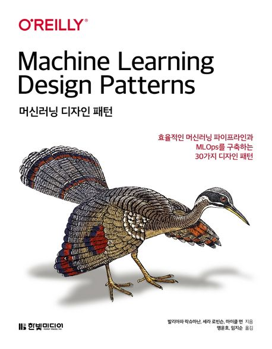

  
<h1 align="center">
  
머신러닝 디자인 패턴

  
</h1>
  

<b>발리아파 락슈마난 · 세라 로빈슨 · 마이클 먼 저, 맹윤호 · 임지순 역</b> 
한빛미디어 · 2021년 11월 01일 출시 
[[github](https://github.com/yunho0130/ml-design-patterns)] | [[errata](https://www.hanbit.co.kr/store/books/look.php?p_code=B3931996053)]</b> 

## :bulb: 목표

- **데이터 준비, 모델 구축, MLOps 전반 이해하기**

  > 임베딩, 체크포인트, 하이퍼파라미터 튜닝 등 다양한 머신 러닝 기술을 익히기

 

## :mag: 목차

### CHAPTER 1 머신러닝 디자인 패턴의 필요성

    1.1 디자인 패턴이란?

    1.2 이 책의 사용법

    1.3 머신러닝 용어

    1.4 머신러닝의 문제

    1.5 마치며

### CHAPTER 2 데이터 표현 디자인 패턴

    2.1 간단한 데이터 표현

    2.2 디자인 패턴 1: 특징 해시

    2.3 디자인 패턴 2: 임베딩

    2.4 디자인 패턴 3: 특징 교차

    2.5 디자인 패턴 4: 멀티모달 입력

    2.6 마치며

### CHAPTER 3 문제 표현 디자인 패턴

    3.1 디자인 패턴 5: 리프레이밍

    3.2 디자인 패턴 6: 멀티라벨

    3.3 디자인 패턴 7: 앙상블

    3.4 디자인 패턴 8: 캐스케이드

    3.5 디자인 패턴 9: 중립 클래스

    3.6 디자인 패턴 10: 리밸런싱

    3.7 마치며

### CHAPTER 4 모델 학습 디자인 패턴

    4.1 일반적인 학습 루프

    4.2 디자인 패턴 11: 유용한 과대적합

    4.3 디자인 패턴 12: 체크포인트

    4.4 디자인 패턴 13: 전이 학습

    4.5 디자인 패턴 14: 분산 전략

    4.6 디자인 패턴 15: 하이퍼파라미터 튜닝

    4.7 마치며

### CHAPTER 5 탄력성 디자인 패턴

    5.1 디자인 패턴 16: 스테이트리스 서빙 함수

    5.2 디자인 패턴 17: 배치 서빙

    5.3 디자인 패턴 18: 연속 모델 평가

    5.4 디자인 패턴 19: 2단계 예측

    5.5 디자인 패턴 20: 키 기반 예측

    5.6 마치며

### CHAPTER 6 재현성 디자인 패턴

    6.1 디자인 패턴 21: 트랜스폼

    6.2 디자인 패턴 22: 반복 가능 분할

    6.3 디자인 패턴 23: 브리지 스키마

    6.4 디자인 패턴 24: 윈도 추론

    6.5 디자인 패턴 25: 워크플로 파이프라인

    6.6 디자인 패턴 26: 특징 저장소

    6.7 디자인 패턴 27: 모델 버전 관리

    6.8 마치며 

### CHAPTER 7 책임 있는 AI

    7.1 디자인 패턴 28: 휴리스틱 벤치마크

    7.2 디자인 패턴 29: 설명 가능한 예측

    7.3 디자인 패턴 30: 공정성 렌즈

    7.4 마치며

### CHAPTER 8 연결 패턴

    8.1 패턴 참조

    8.2 패턴 상호작용

    8.3 ML 프로젝트 내의 패턴

    8.4 사용 사례와 데이터 유형에 따른 일반적인 패턴