# 4 hacking training loop

---

## 4.5 distribution strategy

**distribution strategy**(분산 전략)은 **caching**(캐싱), **hardware acceleration**(하드웨어 가속), **parallelism**(병렬성) 등의 방법으로 training loop를 여러 worker에 걸쳐 확장시키는 design pattern이다.

오늘날 대규모 신경망은 엄청나게 많은 parameter를 사용한다. 오늘날 수백만 개가 넘는 신경망은 쉽게 찾아볼 수 있으며, GPT-3는 그보다도 더 많은 1억 1,700개의 paramter를 가진다. 이렇게 큰 신경망을 구축하면 model performance를 획기적으로 향상시킬 수 있지만, 그만큼 cost(특히 GPU cost)가 훨씬 많이 들게 된다.

예를 들어 NVIDIA M40 GPU 한 대로 90 epoch 동안 'ImageNet dataset을 이용하는 ResNet-50'을 training한다고 치자. 이를 위해서는 1,018회의 single precision 연산이 필요하며 소요되는 시간은 14일이다. 이렇게 신경망 training에 2주씩 소요하는 것은 cost를 매우 낭비하는 비효율적인 방법이다. 

따라서 현재는 GPU cluster를 구축해 이러만 문제를 해결한다.

- 여러 GPU가 장착된 server

- 높은 bandwidth에 latency도 ns 단위인 **Infiniband**를 사용해 server 간 통신을 진행한다.

  > **RDMA**(Remote DMA)라는 통신방식을 써서, 송수신만이 아닌 상대 memory address에 직접 read/write가 가능한 방식으로 통신한다.

---

### 4.5.1 data parallelism, model parallelism

> [초고성능 딥러닝 클러스터 구축하기](https://hyperconnect.github.io/2020/12/21/deep-learning-cluster-1.html)

이를 위해서 training loop에 distribution strategy를 사용한다. 여러가지 방식이 있지만 모두 공통적으로 training에 필요한 계산을 여러 machine에 분산시킨다. 

distribution strategy는 작업을 분할하는 방식에 따라 크게 두 가지 종류로 나눌 수 있다.

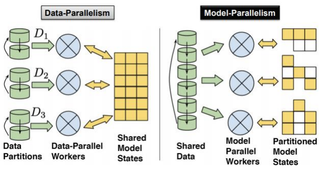

- **data parallelism**

    연산(예를 들면 gradient 계산)을 서로 다른 machine에 distribute한다.

- **model parallelism**

    model을 distribute해서 서로 다른 worker가 model의 다른 부분을 각각 training한다.

data parallelism은 GPU에서 for loop를 thread에 각각 배정해서 parallel하게 연산을 수행하는 것을 떠올리면 쉽다.

```python
for i in range(3):
    a[i] += b[i]
```

```c
thread[0]: a[0] += b[0]
thread[1]: a[1] += b[1]
thread[2]: a[2] += b[2]
```

이러한 data parallelism은 data가 증가함에 따라 parallelism도 증가하고, hardware만 계속해서 늘리는 것으로도 performance를 늘릴 수 있어 **scalability**(확장성)이 뛰어나다.

다음은 data parallelism의 node에 따른 throughput을 나타낸 도표다.

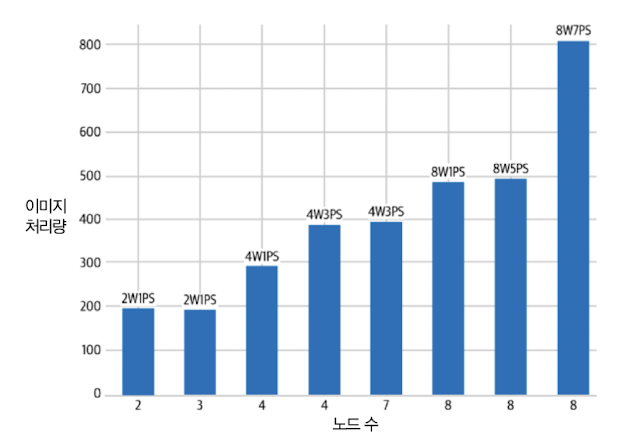

- W: worker, PS: parameter server

  > 예를 들어 2W1PS는 worker가 2개, parameter server가 1개인 경우를 의미한다.

또한 worker가 늘어날수록 최소 loss에 도달하는 시간도 급격히 감소하게 된다.

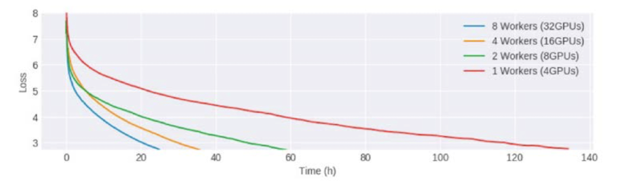

- 1 Worker(빨간색)보다 8 worker(파란색)의 속도가 거의 5배 더 빠르다.

---

#### 4.5.2 data parallelism: synchronous training

우선 data parallelism(DP)에서 **synchronous training**(동기식 학습)을 살펴보자. 

- worker(GPU)들은 model parameter의 복사본을 가진다.

- stochastic gradient descent 단계에서, data를 쪼갠 단위인 mini batch가 각 worker(GPU)에 할당된다.

- 각 worker(GPU)는 받은 mini batch와 model parameter의 연산으로 gradient를 계산한 뒤, 흩어져서 있는 gradient 계산값들을 모아서 집계(예: 평균)한다.

- 집계 결과를 바탕으로 gradient update를 수행한다.

> 하지만 synchronous training은 모든 worker(GPU)의 job이 끝날 때까지 대기해야 하므로, worker가 많을수록 asynchronous training이 효율적이다.

이때 쓰이는 algorithm이 바로 **Allreduce** algorithm이다. 아래가 간단히 Allreduce를 구현한 코드이다.

- id는 각 GPU마다 갖는 구별된 id를 의미한다.

```python
def AllReduce(id, data_send: List[T]) -> List[T]:
  data_recv = []
  # 1. 각 GPU에서 계산된 그라디언트(data_send)를 모두 한 GPU에 모은다.
  Gather(from=id, to=0, src=data_send, dst=data_recv)  # blocking
  # 2. 한 GPU에 모인 그라디언트(data_recv)를 합산한다.
  data_send = sum(data_recv) if id == 0
  # 3. 합산된 그라디언트(data_send)를 모든 GPU로 보내준다.
  Broadcast(from=0, to=id, src=data_send, dst=data_recv)  # blocking
  return data_recv
```

코드를 보면 알 수 있듯이 모든 GPU에서 계산된 gradient를, <U>한 GPU에 모아서 합산</U>하기 때문에 이 통신 과정에서 **bottleneck**이 발생할 수 있다. 

따라서 더 효율적으로 통신하는 algorithm으로 보통 **Ring-Allreduce** algorithm을 사용한다. 다음과 같이 GPU 0 ~ GPU 3까지 총 4대의 GPU가 각각 gradient를 계산한다고 하자.

- GPU0에서 계산된 gradient는 $a_0, b_0, c_0, d_0$ , GPU1에서 계산된 gradient는 $a_1, b_1, c_1, d_1$ 식으로 표기했다.

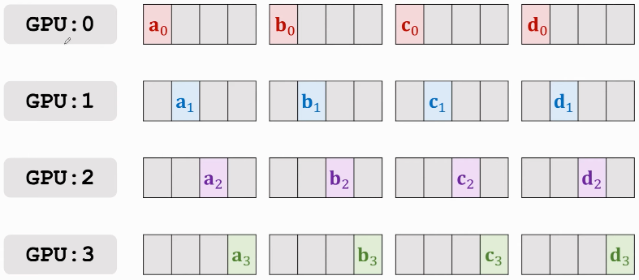

1. GPU 각자가 계산한 gradient를 다음과 같이 GPU를 순환하면서 parameter 일부를 보낸다.(**scatter-reduce**)

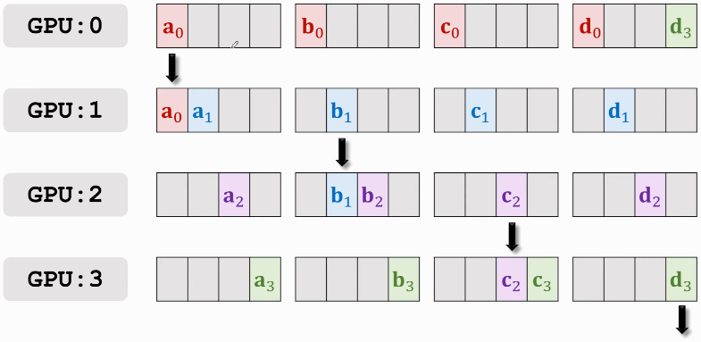

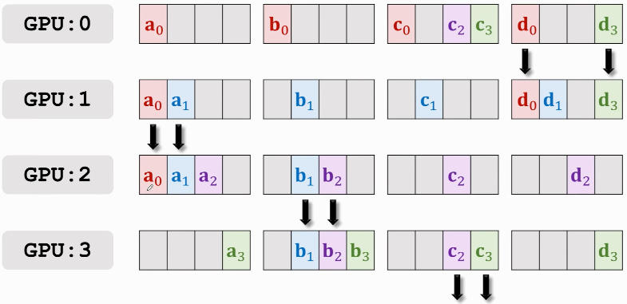

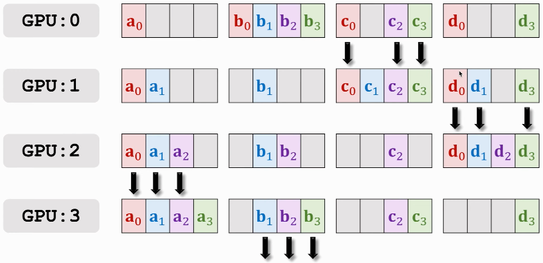

2. 이렇게 한 차례 완성된 parameter는 다시 ring처럼 순환하며 공유된다.(**AllGather**)

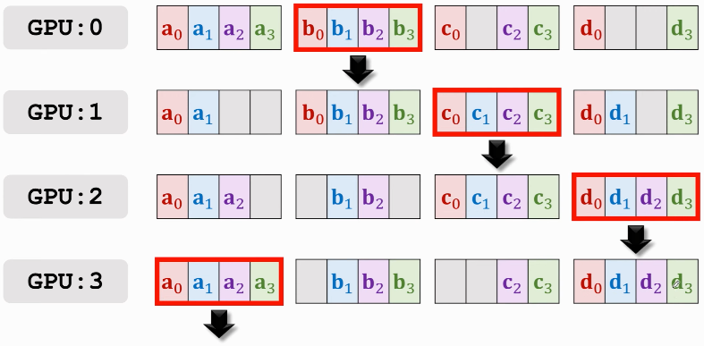

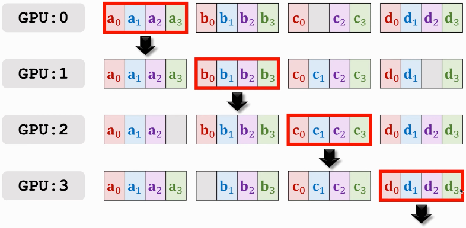

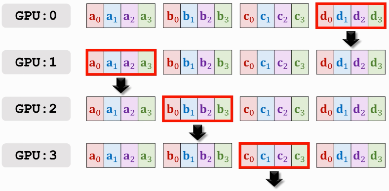

다음은 간단히 Ring-Allreduce를 코드화한 예시다.

```python
def RingAllReduce(id, data: List[T]) -> List[T]:
  # 1. (GPU 개수 - 1)만큼 반복한다.
  for n in range(N-1):
    # 1.1. 합산할 데이터 일부를 다음 GPU로 보내준다.
    Send(to=(id+1), src=data[id-n])  # nonblocking
    # 1.2. 이전 GPU에서 보내준 데이터를 받는다.
    Receive(from=(id-1), dst=data[id-n])  # blocking
    # 1.3. 받은 데이터를 보낼 데이터에 합산한다.
    data[id-1-n] += data[id-n]
  # 2. (GPU 개수 - 1)만큼 반복한다.
  for n in range(N-1):
    # 2.1. 합산된 데이터 일부를 다음 GPU로 보내준다.
    Send(to=(id+1), src=data[id+1-n])  # nonblocking
    # 2.2 이전 GPU에서 보내준 데이터를 받는다.
    Receive(from=(id-1), dst=data[id-n])  # blocking
  return data
```

---

#### 4.5.2.1 Synchronous training with TensorFlow

TensorFlow에서는 `tf.distribute.MirroredStrategy`를 이용해서 synchronous training을 구현할 수 있다.

> 참고로 `MuitiWorkerMirroredStrategy`를 사용하면, 단일 system의 GPU만이 아니라, 여러 system으로 distribution하는 것도 가능하다.

- worker마다 하나의 model parameter replica(복제본)을 만든다.(`MirroredVariable`) 

- model의 각 parameter는 모든 replica에 mirroring되며 서로 동기화된 상태를 유지한다.

layer 3개짜리 model을 `MirroredStrategy`를 이용해서 synchronous training을 구현해 보자. distribution strategy를 적용할 **scope** 내에 model code를 랩핑하기만 하면 된다.

```python
# 미러링된 분산 인스턴스를 만든다.
mirrored_strategy = tf.distribute.MirroredStrategy()
with mirrored_strategy.scope():
    model = tf.keras.Sequential([tf.keras.layers.Dense(23, input_shape=(5,)),
                                 tf.keras.layers.Dense(16, activation='relu'),
                                 tf.keras.layers.Dense(1)])
    model.compile(loss='mse', optimizer='sgd')
```

이렇게 distributed training(synchronous training)을 적용할 scope를 랩핑했다면 평소대로 model training을 진행한다.(`fit()` 또는 `evaluation()` 호출)

```python
model.fit(train_dataset, epochs=2)
model.evaluate(train_dataset)
```

---

#### 4.5.2.1 Synchronous training with PyTorch

PyTorch에서는 `DistributedDataParallel`을 사용한다.(TensorFlow와 달리 단일 system, 여러 system 구분 없이 `DistributedDataParallelism`을 사용한다.)

먼저 필요한 process를 초기화한다. (CUDA Tensor만 사용하는 경우) NVIDIA GPU에서 다중 GPU 및 다중 node 통신을 위해서 **NCCL**(NVIDIA Collective Communication Library)을 사용한다.

```python
torch.distributed.init_process_group(backend="nccl")

# (백엔드, IP주소:Port, group내 process 수, group 내 각 process의 unique id)
#torch.distributed.init_process_group(
#            backend=,
#            init_method=,
#            world_size=,
#            rank=)
```

그 다음으로 process의 rank에 해당되는 `local_rank`를 전달한다.

> distributed training에서는 여러 `process`를 하나의 `group`으로 묶는다. 여기서 하나의 `process`가 GPU 하나에 해당되며, 학습에 사용되는 process의 총 수는 `world_size`라고 한다.(즉, 사용하는 GPU 개수.)

> 각 GPU는 서로 통신할 수 있는데, group 내 각 process는 고유의 `id`인 `rank`를 바탕으로 구분한다.

참고로 `rank`와 `local_rank`의 차이를 잠시 소개하면, local_rank는 node마다 부여되는 id이다. 예를 들어 nodes(machine) 2개가 GPU 두 개씩 갖는다고 하자.(따라서 총 process는 p1, ..., p4) 그러면 `rank`와 `local_rank`는 다음과 같이 표현할 수 있다.

| | Node 1 || Node 2 | |
| :---: | :---: | :---: | :---: | :---: |
| process | p1 | p2 | p3 | p4 |
| local_rank | 0 | 1 | 0 | 1 |
| rank | 0 | 1 | 2 | 3 |

Rank = 0은 master process이고, 1, 2, 3, ...은 worker에 해당된다.

```python
device = torch.device("cuda:{}".format(local_rank))
```

그 다음 model 정보를 device로 전달한 뒤, `DistributedDataParallel`을 이용해서 model의 분산 버전을 생성한다.

```python
model = model.to(device)
ddp_model = DistributedDataParallel(model, device_ids=[local_rank], output_device=local_rank)
```

이때 data를 `DistributedSampler`를 이용해서 나눠야 한다. 그리고 각 data batch를 device로 전송한다.

```python
# data를 나눈다.
sampler = DistributedSampler(dataset=trainds)
train_loader = DataLoader(dataser=trainds, batch_size=batch_size, sampler=sampler , num_workers=4)

# 나눈 data batch를 device로 전송한다.
for data in train_loader:
    features, labels = data[0].to(device), data[1].to(device)
```

이제 PyTorch trainer가 작동을 시작하면 전체 node 수와 각 rank를 알 수 있다.

```bash
python -m torch.distributed.launch --nproc_per_node=4 \
       --nnodes=16 --node_rank=3 --master_addr="192.168.0.1" \
       --master_port=1234 my_train.py
```

- node 수가 1이면 TensorFlow의 `MirroredStrategy`와 동일한 전략이다.

- node 수가 둘 이상이면 TF의 `MultiWorkerMirroredStrategy`와 동일한 전략이다.

---

#### 4.5.3 data parallelism: asynchronous training

**asynchronous training**(비동기식 학습)에서는 각 worker가 input batch를 independent하게 처리한다. 

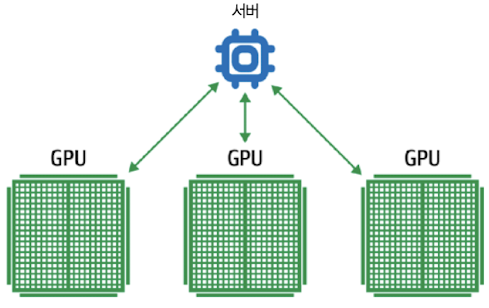

- 각 worker가 계산한 gradient는 parameter server architecture에 전달되어 asynchronous하게 update된다.

server는 synchronous training처럼 AllReduce를 사용하지 않고, 각 worker가 계산한 gradient를 받아서 update를 계속 진행한다. 

- 따라서 느린 worker에 의해 bottleneck이 발생하지 않는다.(시간당 throughput이 높다.)

- 어느 worker가 다운되더라도 다른 worker가 계속 학습을 진행할 수 있다. 대신 mini batch 일부가 손실될 수 있고, 정확한 epoch 수 추적이 어려워질 수 있다.

ML dataset은 종종 terabyte가 넘어가는 데다 training 과정도 굉장히 오랜 시간이 걸린다. 따라서 training 도중 **machine failure**가 발생하는 경우가 굉장히 많다.

이를 위해 training 과정 중 중간 dump 파일인 **checkpoint**를 도입한다. checkpoint에는 model의 entire internal state(weight들, 현재 learning rate 등)가 담겨 있다.

> early stopping을 위해서 사용할 수도 있다. 또는 좀 더 새로운 data에 맞도록 train하기 위해서, 적당히 수렴이 일어난 지점의 checkpoint부터 다시 training할 수 있다.(**fine-tune**)

> 이 때문에 **virtual epoch**라는 개념을 도입해서 수행한다.(4.3절 참조) [ML Design Pattern #3: Virtual Epochs](https://medium.com/google-cloud/ml-design-pattern-3-virtual-epochs-f842296de730)

일반적으로 대규모 신경망이 여러 epoch에 걸쳐 training이 되므로, asynchronous training 과정에서의 작은 불일치는 무시 가능한 수준이다.

구현을 위해 Keras에서는 `ParameterServerStrategy`로 asynchronous training을 지원한다. 

- parameter server 역할을 맡는 system, worker 역할을 맡는 system이 나뉘게 된다.

---
