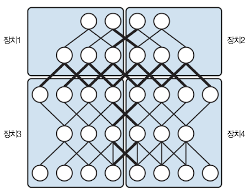
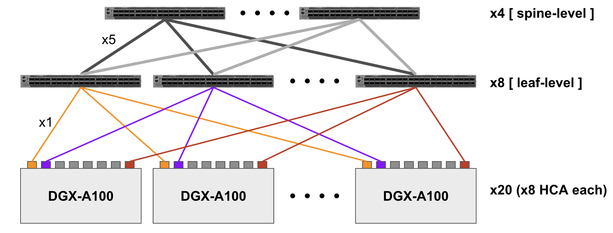
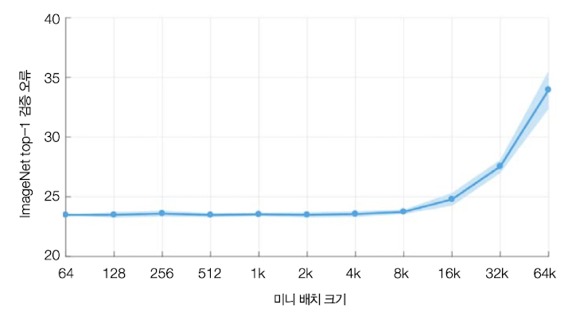
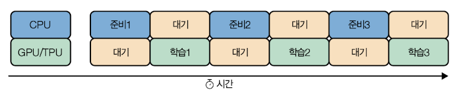
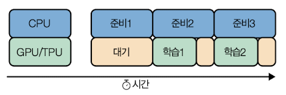
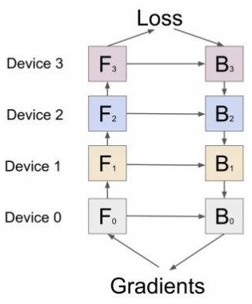
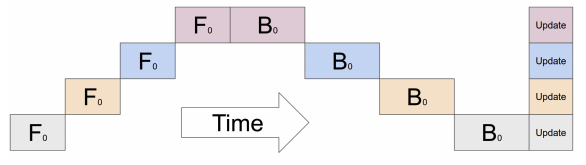

# 4 hacking training loop

---

## 4.5 distribution strategy

**distribution strategy**(분산 전략)은 **caching**(캐싱), **hardware acceleration**(하드웨어 가속), **parallelism**(병렬성) 등의 방법으로 training loop를 여러 worker에 걸쳐 확장시키는 design pattern이다.

오늘날 대규모 신경망은 엄청나게 많은 parameter를 사용한다. 오늘날 수백만 개가 넘는 신경망은 쉽게 찾아볼 수 있으며, GPT-3는 그보다도 더 많은 1억 1,700개의 paramter를 가진다. 이렇게 큰 신경망을 구축하면 model performance를 획기적으로 향상시킬 수 있지만, 그만큼 cost(특히 GPU cost)가 훨씬 많이 들게 된다.

예를 들어 NVIDIA M40 GPU 한 대로 90 epoch 동안 'ImageNet dataset을 이용하는 ResNet-50'을 training한다고 치자. 이를 위해서는 1,018회의 single precision 연산이 필요하며 소요되는 시간은 14일이다. 이렇게 신경망 training에 2주씩 소요하는 것은 cost를 매우 낭비하는 비효율적인 방법이다. 

따라서 현재는 GPU cluster를 구축해 이러한 문제를 해결하고 있다.

- 여러 GPU가 장착된 server

- 높은 bandwidth에 latency도 ns 단위로 효율적인 **Infiniband**라는 기술을 사용해 server 간 통신을 수행한다.

  > **RDMA**(Remote DMA)라는 통신방식을 써서, 송수신만이 아닌 상대 memory address에 직접 read/write가 가능한 방식으로 통신한다.

---

### 4.5.1 data parallelism, model parallelism

> [초고성능 딥러닝 클러스터 구축하기](https://hyperconnect.github.io/2020/12/21/deep-learning-cluster-1.html)

이를 위해서 training loop에 distribution strategy를 사용한다. 여러가지 방식이 있지만 모두 공통적으로 training에 필요한 계산을 여러 machine에 분산시킨다. 

distribution strategy는 작업을 분할하는 방식에 따라 크게 두 가지 종류로 나눌 수 있다.


- **data parallelism**

    연산(예를 들면 gradient 계산)을 서로 다른 machine에 distribute한다.

- **model parallelism**

    model을 distribute해서 서로 다른 worker가 model의 다른 부분을 각각 training한다.

data parallelism은 GPU에서 for loop를 thread에 각각 배정해서 parallel하게 연산을 수행하는 것을 떠올리면 쉽다.

```python
for i in range(3):
    a[i] += b[i]
```

```c
thread[0]: a[0] += b[0]
thread[1]: a[1] += b[1]
thread[2]: a[2] += b[2]
```

이러한 data parallelism은 data가 증가함에 따라 parallelism도 증가하고, hardware만 계속해서 늘리는 것으로도 performance를 늘릴 수 있어 **scalability**(확장성)이 뛰어나다.

다음은 data parallelism의 node에 따른 throughput을 나타낸 도표다.


- W: worker, PS: parameter server

  > 예를 들어 2W1PS는 worker가 2개, parameter server가 1개인 경우를 의미한다.

또한 worker가 늘어날수록 최소 loss에 도달하는 시간도 급격히 감소하게 된다.


- 1 Worker(빨간색)보다 8 worker(파란색)의 속도가 거의 5배 더 빠르다.

---

#### 4.5.2 data parallelism: synchronous training

우선 data parallelism(DP)에서 **synchronous training**(동기식 학습)을 살펴보자. 

- worker(GPU)들은 model parameter의 복사본을 가진다.

- stochastic gradient descent 단계에서, data를 쪼갠 단위인 mini batch가 각 worker(GPU)에 할당된다.

- 각 worker(GPU)는 받은 mini batch와 model parameter의 연산으로 gradient를 계산한 뒤, 흩어져서 있는 gradient 계산값들을 모아서 집계(예: 평균)한다.

- 집계 결과를 바탕으로 gradient update를 수행한다.

> 하지만 synchronous training은 모든 worker(GPU)의 job이 끝날 때까지 대기해야 하므로, worker가 많을수록 asynchronous training이 효율적이다.

이때 쓰이는 algorithm이 바로 **Allreduce** algorithm이다. 아래가 간단히 Allreduce를 구현한 코드이다.

- id는 각 GPU마다 갖는 구별된 id를 의미한다.

```python
def AllReduce(id, data_send: List[T]) -> List[T]:
  data_recv = []
  # 1. 각 GPU에서 계산된 그라디언트(data_send)를 모두 한 GPU에 모은다.
  Gather(from=id, to=0, src=data_send, dst=data_recv)  # blocking
  # 2. 한 GPU에 모인 그라디언트(data_recv)를 합산한다.
  data_send = sum(data_recv) if id == 0
  # 3. 합산된 그라디언트(data_send)를 모든 GPU로 보내준다.
  Broadcast(from=0, to=id, src=data_send, dst=data_recv)  # blocking
  return data_recv
```

코드를 보면 알 수 있듯이 모든 GPU에서 계산된 gradient를, <U>한 GPU에 모아서 합산</U>하기 때문에 이 통신 과정에서 **bottleneck**이 발생할 수 있다. 

따라서 더 효율적으로 통신하는 algorithm으로 보통 **Ring-Allreduce** algorithm을 사용한다. 다음과 같이 GPU 0 ~ GPU 3까지 총 4대의 GPU가 각각 gradient를 계산한다고 하자.

- GPU0에서 계산된 gradient는 $a_0, b_0, c_0, d_0$ , GPU1에서 계산된 gradient는 $a_1, b_1, c_1, d_1$ 식으로 표기했다.


1. GPU 각자가 계산한 gradient를 다음과 같이 GPU를 순환하면서 parameter 일부를 보낸다.(**scatter-reduce**)


2. 이렇게 한 차례 완성된 parameter는 다시 ring처럼 순환하며 공유된다.(**AllGather**)


다음은 간단히 Ring-Allreduce를 코드화한 예시다.

```python
def RingAllReduce(id, data: List[T]) -> List[T]:
  # 1. (GPU 개수 - 1)만큼 반복한다.
  for n in range(N-1):
    # 1.1. 합산할 데이터 일부를 다음 GPU로 보내준다.
    Send(to=(id+1), src=data[id-n])  # nonblocking
    # 1.2. 이전 GPU에서 보내준 데이터를 받는다.
    Receive(from=(id-1), dst=data[id-n])  # blocking
    # 1.3. 받은 데이터를 보낼 데이터에 합산한다.
    data[id-1-n] += data[id-n]
  # 2. (GPU 개수 - 1)만큼 반복한다.
  for n in range(N-1):
    # 2.1. 합산된 데이터 일부를 다음 GPU로 보내준다.
    Send(to=(id+1), src=data[id+1-n])  # nonblocking
    # 2.2 이전 GPU에서 보내준 데이터를 받는다.
    Receive(from=(id-1), dst=data[id-n])  # blocking
  return data
```

---

#### 4.5.2.1 Synchronous training with TensorFlow

TensorFlow에서는 `tf.distribute.MirroredStrategy`를 이용해서 synchronous training을 구현할 수 있다.

> 참고로 `MuitiWorkerMirroredStrategy`를 사용하면, 단일 system의 GPU만이 아니라, 여러 system으로 distribution하는 것도 가능하다.

- worker마다 하나의 model parameter replica(복제본)을 만든다.(`MirroredVariable`) 

- model의 각 parameter는 모든 replica에 mirroring되며 서로 동기화된 상태를 유지한다.

layer 3개짜리 model을 `MirroredStrategy`를 이용해서 synchronous training을 구현해 보자. distribution strategy를 적용할 **scope** 내에 model code를 랩핑하기만 하면 된다.

```python
# 미러링된 분산 인스턴스를 만든다.
mirrored_strategy = tf.distribute.MirroredStrategy()
with mirrored_strategy.scope():
    model = tf.keras.Sequential([tf.keras.layers.Dense(23, input_shape=(5,)),
                                 tf.keras.layers.Dense(16, activation='relu'),
                                 tf.keras.layers.Dense(1)])
    model.compile(loss='mse', optimizer='sgd')
```

이렇게 distributed training(synchronous training)을 적용할 scope를 랩핑했다면 평소대로 model training을 진행한다.(`fit()` 또는 `evaluation()` 호출)

```python
model.fit(train_dataset, epochs=2)
model.evaluate(train_dataset)
```

---

#### 4.5.2.1 Synchronous training with PyTorch

PyTorch에서는 `DistributedDataParallel`을 사용한다.(TensorFlow와 달리 단일 system, 여러 system 구분 없이 `DistributedDataParallelism`을 사용한다.)

먼저 필요한 process를 초기화한다. (CUDA Tensor만 사용하는 경우) NVIDIA GPU에서 다중 GPU 및 다중 node 통신을 위해서 **NCCL**(NVIDIA Collective Communication Library)을 사용한다.

```python
torch.distributed.init_process_group(backend="nccl")

# (백엔드, IP주소:Port, group내 process 수, group 내 각 process의 unique id)
#torch.distributed.init_process_group(
#            backend=,
#            init_method=,
#            world_size=,
#            rank=)
```

그 다음으로 process의 rank에 해당되는 `local_rank`를 전달한다.

> distributed training에서는 여러 `process`를 하나의 `group`으로 묶는다. 여기서 하나의 `process`가 GPU 하나에 해당되며, 학습에 사용되는 process의 총 수는 `world_size`라고 한다.(즉, 사용하는 GPU 개수.)

> 각 GPU는 서로 통신할 수 있는데, group 내 각 process는 고유의 `id`인 `rank`를 바탕으로 구분한다.

참고로 `rank`와 `local_rank`의 차이를 잠시 소개하면, local_rank는 node마다 부여되는 id이다. 예를 들어 nodes(machine) 2개가 GPU 두 개씩 갖는다고 하자.(따라서 총 process는 p1, ..., p4) 그러면 `rank`와 `local_rank`는 다음과 같이 표현할 수 있다.

| | Node 1 || Node 2 | |
| :---: | :---: | :---: | :---: | :---: |
| process | p1 | p2 | p3 | p4 |
| local_rank | 0 | 1 | 0 | 1 |
| rank | 0 | 1 | 2 | 3 |

Rank = 0은 master process이고, 1, 2, 3, ...은 worker에 해당된다.

```python
device = torch.device("cuda:{}".format(local_rank))
```

그 다음 model 정보를 device로 전달한 뒤, `DistributedDataParallel`을 이용해서 model의 분산 버전을 생성한다.

```python
model = model.to(device)
ddp_model = DistributedDataParallel(model, device_ids=[local_rank], output_device=local_rank)
```

이때 data를 `DistributedSampler`를 이용해서 나눠야 한다. 그리고 각 data batch를 device로 전송한다.

```python
# data를 나눈다.
sampler = DistributedSampler(dataset=trainds)
train_loader = DataLoader(dataser=trainds, batch_size=batch_size, sampler=sampler , num_workers=4)

# 나눈 data batch를 device로 전송한다.
for data in train_loader:
    features, labels = data[0].to(device), data[1].to(device)
```

이제 PyTorch trainer가 작동을 시작하면 전체 node 수와 각 rank를 알 수 있다.

```bash
python -m torch.distributed.launch --nproc_per_node=4 \
       --nnodes=16 --node_rank=3 --master_addr="192.168.0.1" \
       --master_port=1234 my_train.py
```

- node 수가 1이면 TensorFlow의 `MirroredStrategy`와 동일한 전략이다.

- node 수가 둘 이상이면 TF의 `MultiWorkerMirroredStrategy`와 동일한 전략이다.

---

#### 4.5.3 data parallelism: asynchronous training

**asynchronous training**(비동기식 학습)에서는 각 worker가 input batch를 independent하게 처리한다. 


- 각 worker가 계산한 gradient는 parameter server architecture에 전달되어 asynchronous하게 update된다.

server는 synchronous training처럼 AllReduce를 사용하지 않고, 각 worker가 계산한 gradient를 받아서 update를 계속 진행한다. 

- 따라서 느린 worker에 의해 bottleneck이 발생하지 않는다.(시간당 throughput이 높다.)

- 어느 worker가 다운되더라도 다른 worker가 계속 학습을 진행할 수 있다. 대신 mini batch 일부가 손실될 수 있고, 정확한 epoch 수 추적이 어려워질 수 있다.

ML dataset은 종종 terabyte가 넘어가는 데다 training 과정도 굉장히 오랜 시간이 걸린다. 따라서 training 도중 **machine failure**가 발생하는 경우가 굉장히 많다.

이를 위해 training 과정 중 중간 dump 파일인 **checkpoint**를 도입한다. checkpoint에는 model의 entire internal state(weight들, 현재 learning rate 등)가 담겨 있다.

> early stopping을 위해서 사용할 수도 있다. 또는 좀 더 새로운 data에 맞도록 train하기 위해서, 적당히 수렴이 일어난 지점의 checkpoint부터 다시 training할 수 있다.(**fine-tune**)

> 이 때문에 **virtual epoch**라는 개념을 도입해서 수행한다.(4.3절 참조) [ML Design Pattern #3: Virtual Epochs](https://medium.com/google-cloud/ml-design-pattern-3-virtual-epochs-f842296de730)

일반적으로 대규모 신경망이 여러 epoch에 걸쳐 training이 되므로, asynchronous training 과정에서의 작은 불일치는 무시 가능한 수준이다.

구현을 위해 Keras에서는 `ParameterServerStrategy`로 asynchronous training을 지원한다. 

- parameter server 역할을 맡는 system, worker 역할을 맡는 system이 나뉘게 된다.

---

### 4.5.4 Task parallelism

하지만 싱경망이 너무 크다면 한 device의 memory에 다 넣을 수 없는 경우가 있다. 이런 공간의 제약을 극복하려면 다른 방식의 parallelism을 사용해야 한다.

우선 사전 지식으로 data가 아니라 program **task**에 의해 parallelism이 결정되는 **task parallelism**(TP)를 알아보자. 아래 코드 예시를 보자.

```python
for i in range(3):
  b[i] = f(a[i])
  c[i] = g(b[i])
```

예시에서는 for loop 내부에서 f(), g()라는 서로 다른 function을 차례로 수행하고 있다.

- g()는 f(a)의 결과를 input으로 받아 output을 산출한다.(**dependency**가 존재)

이를 pipelining 패턴으로 parallelize할 수 있다.

```c
thread[0]:b[0] = f(a[0]) | b[1] = f(a[1]) | b[2] = f(a[2]) |
thread[1]:               | c[0] = g(b[0]) | c[1] = g(b[1]) | c[2] = g(b[2])
```

dependency를 갖기 때문에 data parallelism과 다르게 동시에 연산할 수 있는 thread 수에는 한계가 있다.(overhead가 발생하며 scalability 제약이 있다.)

---

### 4.5.5 Model parallelism

모든 parallelism은 data parallelism과 task parallelism의 조합으로 구성되며 **model parallelism**도 그 중 하나이다.



- training 중 각 device는 input으로 동일한 mini batch data를 사용하지만, model의 개별 구성 요소와 관련된 연산만 수행한다.

model parallelism은 fully-connected layer가 많은 큰 규모의 model에서 효율이 높고 전체 계산 시간을 크게 줄일 수 있다.(latency가 크게 감소)

- model parallelism은 worker 사이에 'neuron의 값이 서로 오고간다.'

- data parallelism은 worker 사이에 'weight 및 gradient가 서로 오고간다.'

> 이 둘을 결합해야 하는 경우도 있다. 예를 들어 **Mesh TensorFlow**는 synchronous parallelism과 model parallelism을 결합하는, distibuted training에 최적화된 library이다.

아래 matrix multiplication(행렬 곱셈) 예제를 보며 model parallelism을 이해해보자.

> python에서 행렬 곱은 \@ 기호를 사용한다.

```python
y[0:3][0:3] = x[0:3][0:3] @ w[0:3][0:3]
```

- x: input matrix, y: output matrix

- w: weight matrix

이러한 matrix multiplication task는 더 작은 matrix multiplication로 쪼갤 수 있다.

1. data parallelism

    data parallelism 관점에서 parallelize할 주된 data는 input에 해당되는 `x`이다. 

    모든 thread가 weight matrix인 `w`를 기본으로 갖고, `x`의 row를 thread에 분배하는 방식으로 parallelism을 구현할 수 있다.(결과로 `y`의 각 row를 얻게 된다.)

    > 이렇게 row 단위로 나누고 합치는 과정이 hardware 관점에서 더 자연스럽고 효율적이다.

    ```python
    # row-wise
    thread[0]: y[0][0:3] = x[0][0:3] @ w[0:3][0:3]
    thread[1]: y[1][0:3] = x[1][0:3] @ w[0:3][0:3]
    thread[2]: y[2][0:3] = x[2][0:3] @ w[0:3][0:3]
    thread[3]: y[3][0:3] = x[3][0:3] @ w[0:3][0:3]
    ```

    하지만 이 경우 다음과 같은 문제가 생길 수 있다.

    - 모든 thread가 `w`를 가지면서 memory를 많이 차지하게 되는데, <U>model size가 한 thread에서 감당할 수 없을 정도로 크다면 parallelism이 불가능</U>하다.

2. model parallelism

    model parallelism 관점에서 parallelize할 주된 data는 parameter(weight)에 해당되는 `w`이다.

    이 경우 동일한 input matrix `x`에 weight matrix `w`를 나눠서 분배한다. 하지만 column-wise 분배이기 때문에, 결과를 합치는 과정에서 memory cost가 더 발생하게 된다.

    ```python
    # column-wise
    thread[0]: y[0:3][0] = x[0:3][0:3] @ w[0:3][0]
    thread[1]: y[0:3][1] = x[0:3][0:3] @ w[0:3][1]
    thread[2]: y[0:3][2] = x[0:3][0:3] @ w[0:3][2]
    thread[3]: y[0:3][3] = x[0:3][0:3] @ w[0:3][3]
    ```

    이런 model parallelism의 특성 때문에 <U>model size가 커지면 커질수록 parallelism도 더 커진다.</U> 

    또한 처리하는 input data가 많아지더라도 (모든 device에 같은 input을 전달해 주기 때문에) parallelism 자체는 변함이 없다.(늘려서 해결할 수 없다.)

    > 이러한 특징이 task parallelism과 일맥상통하는 측면이다.

data parallelism과 같이 scalability를 높일 수는 없다는 점은 비효율적이지만, parameter가 엄청나게 많은 model을 GPU memory에 나눠서 올릴 수 있다는 장점으로 선택하는 방법이라고 볼 수 있다.(물론 이 둘을 함께 사용하는 **pipeline parallelism**을 이용할 수 있다.)

> 하지만 model parallelism에서는 synchronization(동기화), communication overhead(통신 비용) 등의 문제로 여러 한계점을 갖는 경우가 많다.

앞서 설명한 것처럼 GPT-3는 parameter 수가 1,746억 개에 달한다. training에 필요한 계산량만 314,000,000 PFLOP으로, 이는 DGX-A100 한 대의 학습 이론 성능(5 PFLOPS)를 100% 발휘해도 2년이 걸리는 수준이다.

심지어 pre-trained GPT-3 model을 사용해 inference를 하더라도 350GB 이상의 memory가 필요하다.(당연히 training은 이보다 몇 배 더 필요하다.) 하지만 GPU memory size는 많아야 10~40GB 정도이므로, model parallelism이 꼭 필요한 것이다.

> Microsoft Azure에서는 OpenAI를 위해, 계산용 GPU 10,000대에 server당 400Gbps 고속 network로 연결하여 GPT-3를 학습시켰다.

---

### 4.5.6 cluster 구성

딥러닝 cluster는 training을 최대한 빠르게 수행하도록 설계된다. 이 말은 즉, bottleneck이 발생하지 않도록 hardware부터 software까지 모두 최적화를 진행한다는 의미이다.

GPU server를 나타내는 지표는 다양하게 있다.

1. FLOPS

    GPU가 1초에 수행할 수 있는 floating-point 연산 수를 나타낸다. GPU는 floating-point 연산을 처리하는 core가 수천 개 있어서 동시에 수 많은 연산을 처리한다.

    참고로 **precision**(정밀도) 기준에 따라 FLOPS 값이 달라질 수 있다. 보통 FP32(=SP) 성능이 FP64(=DP) 성능의 두 배 정도이다. 또한 FP16(=HP) 성능은 FP32(=SP) 성능의 2배 이상이다.

    > 과학 분야의 연산이 아니라면 높은 precision을 필요로 하지 않는다. 특히 inference 과정에서는 FP16로도 충분하기 때문에 FP16을 사용하는 경우가 많다.

2. memory capacity, bandwidth

    memory **capacity**(메모리 용량)은 GPU가 한 번에 처리할 수 있는 batch size(data parallelism)나 model size(model parallelism)와 밀접하게 관련이 있다.

    > 이와 별개로 system memory capacity도 커야 한다. batch나 model 모두 system memory에서 각 GPU로 전달되는 것이기 때문이다.

    **bandwidth**(대역폭)는 GPU가 memory를 읽고 쓰는 속도와 관련이 있다. bandwidth가 크다고 해서 access 속도가 반드시 빨라지지는 않지만, 넓은 memory space를 동시에 읽고 쓰기 때문에 총 시간이 감소하는 것이 보통이다.


- Activation, Pooling, Normalization과 같이 memory access 횟수 대비 연산이 적은 layer를 보통 **memory-bound**라고 지칭한다.

  > 따라서 bandwidth에 의해 performance 상한이 결정된다.

- Convolution, Dense와 같이 memory access에 비해 연산이 많은 layer는 보통 **compute-bound**라고 지칭한다.

  > 따라서 FLOPS에 의해 performance 상한이 결정된다.

3. Interconnect

    CPU가 관리하는 system memory와 GPU memory는 물리적으로 분리되어 있다.

    - 저장된 dataset으로 train하기 위해서는 system memory에 있는 batch를 GPU memory로 전송해야 한다.

    - GPU에서 train이 끝난 model parameter를 저장하기 위해서는, GPU memory에 있는 parameter를 system memory로 전송해야 한다.

    이외 다른 GPU에 할당된 batch로 계산한 gradient를 합치는 경우나, model parallelism으로 model을 쪼갠 경우는 GPU끼리 통신이 필요할 수 있다.

    같은 server에 장착된 GPU끼리는 PCIe(PCI Express)와 같은 인터페이스를 통해 통신할 수 있다. PCIe는 여러 lane으로 구성되며, PCIe 4.0은 lane 당 약 2GB/s의 bandwidth로 양방향 통신이 가능하다.

    > 보통 GPU는 16 lane 너비(x16)을 지원한다.

    > 예를 들어 CPU가 지원하는 PCIe lane이 16개가 있다면, GPU 한 개를 연결했을 때는 16개가 전부 분배되며, 두 개를 연결하면 각각 8개씩, 3개라면 첫 번째 GPU 8개/두,세 번째 GPU에 각각 4개씩 분배된다.

    2020년대 서버급 Intel CPU에서는 socket당 48 lane을 지원했다. 일반적으로 사용하는 2 socket 구성이라면 48*2 = 96 lane이 사용 가능한 것이다. 따라서 GPU와 HCA(Host Channel Adapter. 고속 네트워크 카드)를 포함해 최대 6개까지만 제 성능을 낼 수 있다.

    > 최신 CPU는 socket당 더 많은 lane을 지원한다.

    NVIDIA에서는 PCIe와 별개로 NVIDIA GPU 간 고속 통신을 위해 NVLink 기술을 제공한다. PCIe 4.0보다 훨씬 넓은 bandwidth로 양방향 통신이 가능지만, 지원을 해주는 일부 메인보드에서만 사용이 가능하다.

하지만 GPU cluster는 다른 server에 장착된 GPU 간에 데이터 통신도 필요하다. 

이를 위해 각 server에는 **HCA**가 설치되어 있어야 한다. HCA는 server의 memory subsystem과는 별개의 PCIe로, 다른 server의 HCA와 고속 **network switch**와 특수 cable로 연결되어 있다.

> network switch는 bridging hub, MAC bridge, switching hub, port switching hub 등으로도 불린다. switch는 각 장치의 MAC 주소를 저장하고 있어서, MAC 주소를 통해 어디로 data를 보낼지 결정한다.

> data를 필요로 하는 장치에만 data가 전송되기 때문에 bottleneck을 방지할 수 있다. 또한 **full duplex** 통신 방식(각각 독립된 회선)을 지원하기 때문에, 송신과 수신이 동시에 일어나는 경우 훨씬 향상된 속도를 제공한다.

이 switch는 또 다른 switch와 연결되며 cluster의 내부망을 구성하게 된다. 이제 다른 server 사이를 연결하는 기술을 알아보자.

1. RDMA

    수많은 server가 data를 교환할 때마다 CPU, cache, OS page를 거치게 되면 엄청난 bottleneck이 발생할 것이다.
    
    > 다른 server의 GPU와 GPU 사이 통신마다 이런 bottleneck이 발생하면 효율이 굉장히 나빠진다.

    이를 방지하기 위해 **RDMA(Remote Direct Memory Access)** 기술이 등장했다. RDMA를 통해 OS의 간섭 없이(CPU는 다른 작업을 수행한다.) 곧바로 HCA를 통해 다른 server로 보내거나, 혹은 HCA를 통해 받은 data를 바로 device로 보낼 수도 있다.

    RDMA를 실현하는 대표적인 기술로 Mellanox의 **Infiniband**가 있고, 범용으로 사용되는 Ethernet 프로토콜을 이용한 RoCE(RDMA over Converged Ethernet)가 있다.

2. Nonblocking Minimal Spanning Switch

    **Nonblocking Minimal Spanning Switch**은 다음과 같은 구조를 뜻한다.

    

    - network를 구성하는 각 switch에 연결된 uplink 수가 downlink 수와 1:1로 동일하다.(따라서 어느 상황이든 두 device끼리 통신이 가능하다.)

    - 이를 만족하면서 network를 구성하는 switch의 개수가 최소이다.

    이러한 nonblocking 구성을 만족하지 못하면, 모든 device가 다른 device와 통신하는 **collective communication** 패턴에서 항상 bottleneck이 발생하게 된다.

    > distributed learning의 AllReduce나 AllGather 연산이 collective communication에 해당된다.

---

### 4.6.7 ASIC, FPGA

training latency를 줄이기 위해 기본 hardware를 강화하는 방식을 사용할 수도 있다. 

- **ASIC**(Application-Specific Intergrated Circuits)가 대표적이 예로, ASIC은 training에서 쓰이는 대형 matrix 연산 성능을 최적화하도록 특별히 설계된 hardware이다.

  Google에서 맞춤 제작한(Google Cloud에서 제공) ASIC인 **TPU**(Tensor Processing Unit)는 vector/matrix 연산에 특화되어 있다.

- 이와 달리 Microsoft Azure는 재구성이 가능한 커스텀 칩인 **FPGA**(Field Programmable Gate Array)를 제공한다. 

ASIC이 프로그래밍이 불가능한 양산형 집적회로인 반면(성능, 전력소모, 가격 모두 더 뛰어나다.), FPGA는 모든 용도로 활용이 가능한 logic block이 담긴 집적회로이다. 따라서 FPGA는 ASIC보다 더 많은 용도로 사용할 수 있지만, 성능, 전력소모, 가격 면에서 모두 뒤떨어진다.

GPU를 이용한 training에서 2주가 걸리는 model을 TPU를 이용하면 몇 시간 이내 수렴할 수도 있다. 그런데 이처럼 **accelerator**(GPU, FPGA, TPU 등의 가속기)가 빨라지면 I/O가 training에서 bottleneck을 심각하게 발생시킬 수 있다.

- training process의 대부분에서 data를 읽고, 이를 accelerator에 copy하고, AllReduce를 통한 gradient update를 기다리는 시간에서 많은 시간이 낭비된다.

이러한 해결책으로 TPU pod(수 천개의 TPU 그룹)에는 고속 상호 연결이 존재한다. pod 내에서는 통신으로 드는 비용과 시간이 매우 적고, 사용 가능한 disk memory도 많아서 CPU 호출 빈도도 줄일 수 있다.

distributed learning 관점에서는 `TPUStrategy`를 사용하면 TPU를 이용한 training을 실행할 수 있다. TPU가 자체적으로 AllReduce algorithm을 구현하지만, 내부적으로는 `MirroredStrategy`와 동일하다.

> TPU는 Google Colaborataory에서도 사용할 수 있다.

---

### 4.6.8 다른 고려할 요소

1. batch size

    synchronize data parallelism에서 model size가 크다면, **batch size**는 매우 중요하게 고려할 요소가 된다.

    각 단계마다 worker 모두가 update된 model을 공유해야 하므로, batch size를 가능한 크게 해서 통신 비용을 줄이는 편이 좋다.

    하지만 batch size가 너무 커도 안 된다. batch size가 커지면 gradient의 variance가 커지고, 이는 gradient descent의 수렴 속도를 늦춘다.

    아래 그림을 보면 batch size를 너무 크게 설정했을 때 top-1 validation error가 더 커지는 것을 확인할 수 있다.

    

    > 따라서 batch size에 맞춰 learning rate를 조절해 주기도 한다.

    > LAMB라는 계층별 적응형 대규모 batch optimization algorithm이 있다. 이는 batch size가 커지면 learning rate를 줄이는 방식으로 gradient variance를 줄이는 방식이다.

2. I/O 대기 최소화

    앞서 언급한 것처럼 I/O pipeline이 accelerator의 속도를 따라잡기 어려워 bottleneck이 발생할 수 있다. 이러한 bottleneck을 해결하기 위해 input pipeline을 최적화하는 방법이 중요한 과제로 떠올랐다.

    다음은 TensorFlow에서 적용할 수 있는 예시 두 가지다.

    - TFRecords와 같이 최적화된 파일 형식을 사용한다.

    - TF의 `tf.data` API를 사용해서 data pipeline을 자체적으로 구축한다.

    `tf.data` API는 대량의 data 처리가 가능하며 효율적인 pipeline의 구성이 가능하다. 예를 들어 `tf.data.Dataset.prefecth`는 training 단계의 전처리와 model 실행 작업을 parallel하게 수행할 수 있도록 한다.

    원래라면 CPU가 input pipeline, 즉 storage에서 data를 읽고, 전처리하고, accelerator에 전달한다. 

    

    하지만 전처리, 모델 실행 과정을 parallel하게 수행하도록 하면, input pipeline이 쉬지 않고 다음 단계를 위한 준비를 수행하게 된다.

    

3. **pipeline parallelism**

    한 worker에 load하기 너무 큰 model은, model parallelism을 적용해서 model을 여러 worker에 나눠서 넣게 된다. 
    
    그런데 만약 sequential model을 naive하게 training한다면, 아래와 같이 한 번에 하나의 GPU만 활성화되며 GPU idle이 발생할 것이다.

    

    - sequential layer들을 accelerator 4개에 partitioning해서 넣는다.

    - $F_{k}$ : $k$ 번째 partition의 forward computation.

    - $B_{k}$ : $k$ 번째 partition의 backpropagation.

    여기서 중요한 point로 backpropagation의 특성상 $B_{k}$ 는 $B_{k+1}$ 과 $F_{k}$ 가 존재해야만 연산이 가능하다. 따라서 training은 다음과 같은 순서로 진행된다.

    

    - backpropagation 연산을 진행하기까지 **bubble**이 발생한다.

    여기서 Gpipe(2018) 논문은 batch를 **micro-batch**라는 단위로 쪼개서 처리하면서 GPU idle을 최대한 줄이는 방법을 제안했다.

    

    > 이상적으로는 약 2배 가량 시간이 줄어들게 된다. 하지만 여전히 bubble은 존재한다.

---
